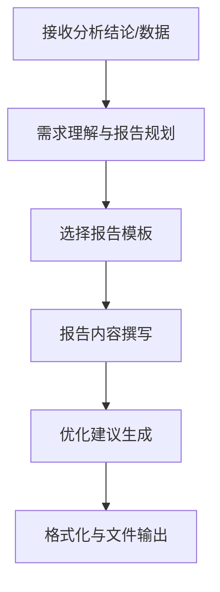
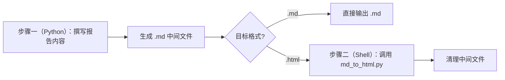

# 数据分析报告撰写专家（Data Analysis Report Writer）

## 概述

本参考 Skill 专用于**将数据分析结论撰写为结构化的分析报告**。典型场景：将 `excel-processing-and-analysis` 等技能的分析结果，整理为正式的分析报告文件。

> ⚠️ **职责边界**：本 Skill **不负责**数据文件读取、数据清洗、统计计算等数据分析工作。仅接收分析结论，负责报告的结构设计、内容撰写、建议生成和格式化输出。

## 适用场景

| 场景 | 推荐模板 | 输出格式 | 说明 |
|------|---------|---------|------|
| **产品销售分析** | 通用数据分析报告 | 有图表：`.html`；无图表：`.md` | 销量趋势、季节性特征、区域差异、利润贡献、增长潜力 |
| **门店经营分析** | 通用数据分析报告 | 有图表：`.html`；无图表：`.md` | 营收趋势、坪效对比、客流转化、成本结构、运营效率 |
| **学生成绩分析** | 个人/组织表现评估与增长洞察 | 有图表：`.html`；无图表：`.md` | 成绩变化趋势、学科优势与短板、成绩稳定性、潜力与不足、排名变化 |
| **员工绩效分析** | 个人/组织表现评估与增长洞察 | 有图表：`.html`；无图表：`.md` | KPI 达成情况、能力画像、成长轨迹、团队贡献度、改进空间 |
| **其他数据分析** | 通用数据分析报告 | 有图表：`.html`；无图表：`.md` | 任何将数据分析结论整理为分析报告的场景 |

> 提供两套模板：**通用数据分析报告**适用于一般性数据分析场景；**个人/组织表现评估与增长洞察**适用于需要对个体或组织进行多维度、多周期评估与增长分析的场景。可根据实际需要灵活选择或混合使用。

## 核心工作流



### 阶段 1：需求理解与报告规划 🎯

1. **确认输入来源**：分析结论从何而来？（上游 skill 传递的数据、用户提供的素材等）
2. **明确报告主体**：谁/什么是报告的对象？（每个学生、每个员工、每个产品等）
3. **确定报告类型**：个体分析报告、汇总对比报告、综合分析报告等
4. **确认输出要求**：报告格式（用户指定格式优先；未指定时，有图表默认 `.html`，无图表默认 `.md`）、是否逐个生成、命名规则

### 阶段 2：报告内容撰写 ✍️

**撰写原则：**
1. **数据驱动**：所有结论必须有数据支撑，禁止主观臆断
2. **全面覆盖**：**必须分析数据中出现的所有维度/分类/指标**，不得遗漏。如数据包含 N 个维度，报告必须覆盖全部 N 个维度，不能只分析其中一部分
3. **不编造数据**：报告中出现的所有数值必须来源于原始数据，**绝对禁止凭常识或假设编造**。如果原始数据中没有提供某个基准值（如满分、目标值、预算额等），**必须省略该列或标注"未提供"**，不得自行填写
4. **优劣并述**：客观呈现优势与不足，不报喜不报忧
5. **层次分明**：从概览到细节，逻辑递进
6. **语言专业**：用词准确、表述简洁、避免口语化

> ⚠️ **质量检查清单**（撰写完成后必须核对）：
> - [ ] 数据中的每个维度/分类/指标是否都在报告中有体现？
> - [ ] 数据明细表是否包含了所有维度（而非只列举部分）？
> - [ ] 优势和不足的分析是否基于全部维度进行排序和筛选？
> - [ ] 建议是否覆盖了表现异常的每个维度（而非只关注部分维度）？
> - [ ] **所有数值是否均来自原始数据？是否存在编造的数值？** 如果原始数据未提供某个基准值，报告中不得出现该数值

### 阶段 3：优化建议生成 💡

**建议撰写标准：**
- ❌ "需要加强学习" → 太笼统
- ✅ "数学成绩连续 3 次下降（从 92 → 85 → 78），建议每周增加 2 小时针对函数与几何的专项练习" → 有数据、有方向、可执行

**建议结构：**
- 针对每个不足点给出具体改进方案
- 针对优势给出保持/提升策略
- 区分短期行动和长期规划

### 阶段 4：格式化与文件输出 📦

**输出格式：**
- 用户指定格式优先；未指定时，有图表默认输出 `.html`，无图表默认输出 `.md`
- 所有非 `.md` 格式均采用"先生成 `.md` 中间文件，再转换为目标格式"的架构（详见下方「报告格式转换」章节）

**批量报告输出规则：**
- 每个分析对象单独一份报告文件，命名规则 `{对象名称}_分析报告.{ext}`，额外生成一份 `汇总报告.{ext}`
- 所有报告文件统一存放在用户指定的输出目录下
- 批量报告的输出格式统一，不允许同一批次中混合不同格式

---

### 通用数据分析报告模板

适用于：所有数据分析报告场景。根据实际数据内容动态调整板块名称和内容。

#### 个体分析报告

```markdown
# {分析对象名称} 分析报告

## 📊 核心摘要
| 指标 | 数据 |
|------|------|
| {指标1} | {数据1} |
| {指标2} | {数据2} |

## 📋 数据明细
[根据场景生成数据表格]

## 📈 可视化图表
<!-- 根据输出格式选择对应的图表嵌入方式 -->

<!-- 输出 .html 时：使用 ECharts 占位标记 -->
<!-- ECHARTS: {"chart_type": "bar", "title": "{图表主题描述}", "data": {"labels": ["{类别1}", "{类别2}"], "values": [{数值1}, {数值2}]}} -->

<!-- 输出 .md 时：使用图片相对路径引用 -->
<!--  -->

## ✅ 优势/亮点
1. **{维度}**：{说明，含数据支撑}
2. ...

## ⚠️ 不足/风险
1. **{维度}**：{说明，含数据支撑}
2. ...

## 💡 改进建议
1. {针对不足的具体改进建议，有数据依据，可执行}
2. {针对优势的保持/提升策略}
3. ...
```

#### 汇总报告

```markdown
# {主题} 综合分析报告

> 分析时间：{时间范围} | 分析对象数：{N}

## 📊 总览数据
[汇总数据表格]

## 📈 排名/趋势变化
[排名对比表格]

## 💡 整体建议
[基于汇总数据的整体性建议]
```
---

### 个人/组织表现评估与增长洞察模板

适用于：需要对个体或组织进行多维度、多周期的表现评估与增长分析的场景，如学生成绩分析、员工绩效评估、门店经营评比等。

#### 个体评估报告

```markdown
# {组织名} 个体表现评估报告 - {个体名称}

## 📊 核心摘要

| 指标 | 数据 |
|------|------|
| 综合得分趋势 | {小幅上升/小幅下降/显著上升/显著下降/基本平稳/明显下降} |
| 周期平均综合得分 | {XXX.X} 分 |
| 排名趋势 | {具体描述，如「基本稳定（变化+2名）」} |
| 表现稳定性 | {稳定/波动较大/逐步稳定/波动明显加大} |
| 最佳排名 | 第{X}名 |
| 最新排名 | 第{Y}名 |
| 最新综合得分 | {XXX} |

---

## 📋 各周期评估明细

| 维度 | 基准值 | {周期1} | {周期2} | ... | 周期均值 | 趋势 | 稳定性 |
|------|--------|---------|---------|-----|----------|------|--------|
| {维度1} | {基准值} | {得分} | {得分} | ... | {均值} | {趋势} | {稳定性} |
| {维度2} | {基准值} | {得分} | {得分} | ... | {均值} | {趋势} | {稳定性} |
| ... | ... | ... | ... | ... | ... | ... | ... |
| **综合** | **{基准值}** | **{总分}** | **{总分}** | ... | **{均值}** | **{趋势}** | **{稳定性}** |
| 排名 | — | 第X名 | 第X名 | ... | — | — | — |

---

## ✅ 优势维度（达成率最高）

| 维度 | 达成率 | 与群体均值差 | 趋势 |
|------|--------|-------------|------|
| {维度1} | {XX.X%} | {+XX.X} | {趋势} |
| {维度2} | {XX.X%} | {+XX.X} | {趋势} |
| {维度3} | {XX.X%} | {+XX.X} | {趋势} |

## ⚠️ 待提升维度（达成率最低）

| 维度 | 达成率 | 与群体均值差 | 趋势 |
|------|--------|-------------|------|
| {维度1} | {XX.X%} | {-XX.X} | {趋势} |
| {维度2} | {XX.X%} | {-XX.X} | {趋势} |
| {维度3} | {XX.X%} | {-XX.X} | {趋势} |

---

## 💡 个性化建议

- {建议1：如「综合得分呈上升趋势，进步明显！继续保持当前节奏」}
- {建议2：如「表现波动较大，建议加强日常积累的持续性和规律性」}
- {建议3：如「维度 A 呈下降趋势（变化-6.5），需引起重视」}
- {建议4：如「维度 B 是明显优势（达成率89.8%），继续保持」}
- {建议5：如「维度 C 连续下滑（从82→75→68），建议重点强化相关能力模块」}
- {建议6：如「维度 D 虽为弱势（达成率62.3%），但近两次有回升趋势，应乘势加强」}
- {建议条数根据实际分析结果动态生成，通常 5-12 条}
```

#### 组织整体汇总报告

```markdown
# {组织名} 表现综合分析报告

> 数据来源：{周期1} / {周期2} / ... | 用途：{用途说明}

---

## 一、各周期维度平均得分

| 维度 | 基准值 | {周期1} | {周期2} | ... | 趋势 | 变化 |
|------|--------|---------|---------|-----|------|------|
| {维度1} | {基准值} | {均值} | {均值} | ... | {趋势} | {变化} |
| {维度2} | {基准值} | {均值} | {均值} | ... | {趋势} | {变化} |
| ... | ... | ... | ... | ... | ... | ... |
| **综合** | **{基准值}** | **{均值}** | **{均值}** | ... | **{趋势}** | **{变化}** |

---

## 二、排名变化总览

| 个体 | {周期1}排名 | {周期2}排名 | ... | 排名变化 | 综合趋势 | 稳定性 |
|------|------------|------------|-----|----------|----------|--------|
| {个体1} | 第X名 | 第X名 | ... | {+/-N} | {趋势} | {稳定性} |
| {个体2} | 第X名 | 第X名 | ... | {+/-N} | {趋势} | {稳定性} |
| ... | ... | ... | ... | ... | ... | ... |

（以上为必选板块，可根据实际分析内容动态扩展其他板块，如：各维度整体表现、需重点关注的个体、改进建议等。）
```

> **💡 场景映射示例 — 学生成绩分析：**
>
> | 模板术语 | 对应含义 | 示例 |
> |---------|---------|------|
> | 组织 | 班级 | 高三(1)班 |
> | 个体 | 学生 | 张三 |
> | 维度 | 学科 | 语文、数学、英语、物理、化学… |
> | 周期 | 考试 | 月考一、期中考试、月考二、期末考试 |
> | 基准值 | 满分 | 150（语文）、150（数学）… |
> | 达成率 | 得分率 | 85.3%（=128/150） |
> | 与群体均值差 | 与班级均分差 | +12.5 分 |
> | 综合得分 | 总分 | 652 分 |
>
> 其他场景（员工绩效、门店评比等）同理，将模板术语替换为对应业务概念即可。

---

## 图表嵌入规范

报告中的图表嵌入支持两种方式，根据输出格式选择对应的嵌入方式：

| 输出格式 | 图表嵌入方式 | 说明 |
|---------|------------|------|
| `.html` | **ECharts 动态图表**（优先） | 使用 `<!-- ECHARTS: {JSON} -->` 占位标记，转换时自动渲染为交互式图表 |
| `.md` | **图片相对路径引用** | 使用 `` 相对路径引用图片文件 |

> ℹ️ 当上游技能同时传递了图片文件路径和结构化图表数据时，优先使用结构化数据进行 ECharts 渲染。

### ECharts 图表数据占位标记（输出 `.html` 时使用）

当输出格式为 `.html` 且上游技能传递了结构化图表数据时，在 Markdown 中使用 HTML 注释格式的占位标记嵌入图表数据：

```markdown
<!-- ECHARTS: {"chart_type": "bar", "title": "月度销售额对比", "data": {"labels": ["1月", "2月", "3月"], "values": [120, 200, 150]}} -->
```

**占位标记规则：**
- 格式：`<!-- ECHARTS: {完整JSON} -->`，一行一个图表
- 图表数据以 HTML 注释形式嵌入，Markdown 渲染时不会显示
- `md_to_html.py` 转换时会自动解析并替换为 ECharts `<div>` + `<script>` 渲染代码
- 支持的图表类型：柱状图(bar)、折线图(line)、饼图(pie)、雷达图(radar)、散点图(scatter)

详细的图表数据 JSON 结构规范见下方「ECharts 图表数据协议」章节。

### ECharts 图表数据协议

图表数据 JSON 结构规范如下：

| 字段 | 类型 | 必填 | 说明 |
|------|------|------|------|
| `chart_type` | string | ✅ | 图表类型：`bar`（柱状图）、`line`（折线图）、`pie`（饼图）、`radar`（雷达图）、`scatter`（散点图） |
| `title` | string | ✅ | 图表标题，将显示在图表上方 |
| `data` | object | ✅ | 数据集，包含 `labels` 和 `values`/`series` |
| `options` | object | ❌ | 可选的 ECharts 原生配置项，用于覆盖默认生成的 option（高级用法） |

**`data` 字段结构：**

| 字段 | 类型 | 说明 |
|------|------|------|
| `labels` | string[] | 数据标签/类别名称列表 |
| `values` | number[] | 单系列数据值列表（与 `labels` 一一对应） |
| `series` | object[] | 多系列数据（与 `values` 二选一），每项包含 `name`（系列名）和 `values`（数据值列表） |

#### 各图表类型完整示例

**柱状图（bar）— 单系列：**

```json
<!-- ECHARTS: {"chart_type": "bar", "title": "各区域销售额", "data": {"labels": ["华东", "华南", "华北", "西南", "华中"], "values": [320, 280, 250, 180, 210]}} -->
```

**柱状图（bar）— 多系列：**

```json
<!-- ECHARTS: {"chart_type": "bar", "title": "各区域季度销售对比", "data": {"labels": ["华东", "华南", "华北", "西南"], "series": [{"name": "Q1", "values": [120, 100, 90, 70]}, {"name": "Q2", "values": [150, 130, 110, 85]}, {"name": "Q3", "values": [180, 160, 130, 95]}]}} -->
```

**折线图（line）— 多系列：**

```json
<!-- ECHARTS: {"chart_type": "line", "title": "月度销售额与利润趋势", "data": {"labels": ["1月", "2月", "3月", "4月", "5月", "6月"], "series": [{"name": "销售额", "values": [120, 200, 150, 180, 250, 220]}, {"name": "利润", "values": [30, 50, 40, 45, 65, 55]}]}} -->
```

**饼图（pie）：**

```json
<!-- ECHARTS: {"chart_type": "pie", "title": "产品类别销售占比", "data": {"labels": ["电子产品", "服装", "食品", "家居", "其他"], "values": [35, 25, 20, 12, 8]}} -->
```

**雷达图（radar）：**

```json
<!-- ECHARTS: {"chart_type": "radar", "title": "员工能力画像", "data": {"labels": ["技术能力", "沟通能力", "团队协作", "创新思维", "执行力", "学习能力"], "values": [90, 75, 85, 70, 88, 82]}} -->
```

**散点图（scatter）：**

```json
<!-- ECHARTS: {"chart_type": "scatter", "title": "价格与销量关系", "data": {"labels": [], "values": [[10, 120], [15, 95], [20, 80], [25, 70], [30, 55], [35, 40]]}} -->
```

**使用自定义 options 覆盖默认配置（高级用法）：**

```json
<!-- ECHARTS: {"chart_type": "bar", "title": "自定义样式示例", "data": {"labels": ["A", "B", "C"], "values": [100, 200, 150]}, "options": {"color": ["#5470c6", "#91cc75", "#fac858"], "series": [{"itemStyle": {"borderRadius": [8, 8, 0, 0]}}]}} -->
```

#### 向后兼容

- 旧的图片路径传递方式仍然可用，当输出格式为 `.md` 时继续使用图片引用方式
- 当上游技能同时传递了图片文件路径和结构化图表数据时，**优先使用结构化数据**进行 ECharts 渲染（仅在输出 `.html` 时）
- 如果上游技能仅传递了图片文件路径（未提供结构化数据），`md_to_html.py` 转换时会自动将图片以 base64 Data URI 方式内嵌到 HTML 中，确保自包含

### 图片相对路径引用（仅在输出 `.md` 格式时使用）

当上游技能（如 `excel-processing-and-analysis`）在分析过程中生成了可视化图表，并将图表文件路径传递给本技能时，**必须**按照以下规范将图表文件复制到输出目录并以相对路径方式引用。

### 图表预处理流程

接收到图表文件清单后，在撰写报告之前，**必须先执行以下 Python 代码**将所有图表文件复制到输出目录下的 `charts/` 子目录：

```python
import os
import shutil


def prepare_charts(chart_files: list[dict], output_dir: str) -> dict:
    """将图表文件复制到输出目录下的 charts/ 子目录，并生成相对路径映射。

    :param chart_files: 上游技能传递的图表信息列表
        格式：[{"path": "绝对路径", "description": "主题描述", "section": "建议章节"}, ...]
    :param output_dir: 报告输出目录的绝对路径
    :return: 图表描述到 Markdown 图片语法的映射字典
    """
    charts_dir = os.path.join(output_dir, "charts")
    os.makedirs(charts_dir, exist_ok=True)

    chart_md_map = {}
    for chart in chart_files:
        src_path = chart["path"]
        description = chart["description"]
        filename = os.path.basename(src_path)
        dst_path = os.path.join(charts_dir, filename)

        if not os.path.exists(src_path):
            print(f"[警告] 图表文件不存在：{src_path}")
            chart_md_map[description] = {
                "md": f"[图表加载失败：{description}]",
                "section": chart.get("section", ""),
            }
            continue

        try:
            shutil.copy2(src_path, dst_path)
            md_img = f""
        except Exception as e:
            print(f"[警告] 图表复制失败：{src_path}，错误：{e}")
            md_img = f"[图表加载失败：{description}]"

        chart_md_map[description] = {
            "md": md_img,
            "section": chart.get("section", ""),
        }

    return chart_md_map


# 使用示例
# chart_files 为上游技能传递的图表信息列表
# output_dir 为报告输出目录
chart_md_map = prepare_charts(chart_files, output_dir)

# 在撰写报告时，根据 chart_md_map 将图表嵌入到对应章节中
```

### 图表嵌入语法

**ECharts 占位标记方式（输出 `.html` 时）：**

```markdown
分析结果显示，各月销售额呈现明显的季节性波动……

<!-- ECHARTS: {"chart_type": "bar", "title": "月度销售额与利润趋势", "data": {"labels": ["1月","2月","3月","4月"], "series": [{"name": "销售额", "values": [120,200,150,180]}, {"name": "利润", "values": [30,50,40,45]}]}} -->
```

**图片相对路径方式（输出 `.md` 时）：**

```markdown

```

### 图文排版原则

1. **先文字后图表**：每张图表必须紧跟在对应分析章节的文字描述之后，不得将图表放在文字之前
2. **alt 文本必填**：`` 中的 alt 文本必须填写图表的主题描述（如"月度销售额与利润趋势"），不得留空
3. **图表与文字间隔**：图表的 Markdown 语法前后各空一行，确保渲染时有适当间距
4. **章节对应**：根据上游技能传递的"建议章节"信息，将图表嵌入到报告的对应分析章节中

### 容错处理

- 如果某张图表文件不存在或复制失败，在报告对应位置标注 `[图表加载失败：{主题描述}]`，不影响其他图表和报告的正常生成
- 如果上游技能未传递任何图表信息，则仅输出纯文字报告，不得使用 `` 语法引用不存在的图片

### ☢️ 图表嵌入红线规则

> 以下规则为**绝对禁止项**，任何情况下不得违反：

1. **禁止使用绝对路径引用图片**：严禁在报告中使用 `` 或任何形式的绝对路径引用，必须使用相对路径（如 ``）
2. **禁止在 Markdown 中使用 base64 Data URI 嵌入图片**：严禁使用 `` 方式嵌入图表（注：`md_to_html.py` 转换时会自动将图片转为 base64 内嵌，但 Markdown 源文件中禁止直接使用）
3. **禁止引用不存在的图片**：如果没有收到图表数据，不得在报告中生成任何 `` 图片引用语法或 `<!-- ECHARTS: ... -->` 占位标记
4. **必须先复制图表文件再引用**（仅图片方式）：接收到图表文件路径时，必须先通过 Python 代码将图表文件复制到输出目录下的 `charts/` 子目录，再在报告中使用相对路径引用
5. **ECharts 占位标记仅用于 `.html` 输出**：当输出格式为 `.md` 时，禁止使用 `<!-- ECHARTS: ... -->` 占位标记

---

## 报告格式转换

所有非 `.md` 格式的报告，均采用“先生成 `.md` 中间文件，再转换为目标格式”的架构。

### 转换流程（两步走架构）

> ⚠️ **核心原则：步骤分离**
> - **步骤一（Python 代码）**：只负责撰写报告内容并生成 `.md` 文件，**不得在 Python 代码中通过 `subprocess` 调用格式转换脚本**
> - **步骤二（Shell 命令）**：用独立的 Shell 命令调用转换脚本，与报告内容生成完全解耦
> - 这样做的好处：职责分离、减少代码出错、转换失败时可单独重跑 Shell 命令



### 步骤一：生成 `.md` 中间文件（Python 代码）

用 Python 代码撰写报告内容并保存为 `.md` 文件。此步骤**仅负责内容生成**，不涉及任何格式转换逻辑，不得 `import subprocess`。

### 步骤二：格式转换（Shell 命令）

在 Python 代码执行完成后，使用**独立的 Shell 命令**调用转换脚本。

> ⚠️ **Shell 兼容性注意事项**：
> - **禁止使用 `&&` 连接多条命令**（如 `cd "xxx" && python ...`），因为 PowerShell 5.x 不支持 `&&` 操作符，会报错：`标记"&&"不是此版本中的有效语句分隔符`
> - **禁止使用 `cd` 切换目录后再执行命令**，应直接使用脚本的绝对路径调用
> - 正确做法：直接用 `python "<脚本绝对路径>" "<参数>"` 执行，不需要先 cd 到脚本所在目录

#### `.md` → `.html` 转换（有图表时的默认路径）

调用 `report-writer` 技能的 `scripts/md_to_html.py`（基于 pandoc）。脚本会自动解析 Markdown 中的 ECharts 占位标记并渲染为动态图表，同时将图片转为 base64 内嵌，确保 HTML 文件完全自包含。

```bash
# 基本转换
python "<report-writer技能根目录>/scripts/md_to_html.py" "报告.md" "报告.html"

# 指定图表数据
python "<report-writer技能根目录>/scripts/md_to_html.py" "报告.md" "报告.html" --chart-data charts.json
```

**`md_to_html.py` 支持的完整参数列表：**

| 参数 | 必填 | 说明 |
|------|------|------|
| `input_file`（位置参数） | ✅ | 输入 Markdown 文件路径 |
| `output_file`（位置参数） | ✅ | 输出 HTML 文件路径 |
| `--chart-data` | ❌ | 图表数据 JSON 文件路径 |

> ℹ️ 主题色（`#2E86AB`）和代码高亮主题（`tango`）已内置，无需额外传参。


### 容错处理

> ⚠️ **核心原则：报告正文中严禁包含任何格式转换状态的警告信息。** 警告信息只能在转换失败后，通过追加写入的方式添加到 `.md` 文件末尾。

**正确的容错流程：**

1. **步骤一（Python 代码）**：生成纯净的 `.md` 中间文件，**不包含任何关于 pandoc / 转换状态的提示文字**
2. **步骤二（Shell 命令）**：执行格式转换命令
3. **处理结果**：
   - 转换成功（Shell 命令返回码为 0）→ 正常输出目标格式文件，清理中间文件
   - 转换失败（Shell 命令返回码非 0，或 pandoc 未安装、路径异常等任何原因）→ 回退输出 `.md` 格式，并通过 Shell 命令在 `.md` 文件末尾追加警告：

```bash
# 仅在转换失败时执行，将警告追加到已生成的 md 文件末尾
echo "" >> "报告.md"
echo "> ⚠️ 因格式转换失败，已回退为 Markdown 格式输出。如需 HTML 格式，请检查 pandoc 安装。" >> "报告.md"
```

- 回退时，图表文件保留在 `charts/` 子目录中，确保 md 中的相对路径引用仍然有效

**❌ 错误做法（严禁）：**
- 在撰写报告内容时就预先写入 `⚠️ 因pandoc转换失败，已回退为Markdown格式输出` 等警告文字
- 在报告模板中包含转换状态相关的占位符或条件文字
- **在 Python 代码中通过 `subprocess` 调用 `md_to_html.py` 进行格式转换**（格式转换必须作为独立的 Shell 命令执行）

### 转换后清理

- 格式转换成功后，**清理 `.md` 中间文件**（仅当最终格式不是 `.md` 时）

- 格式转换成功且最终格式为 `.html` 时，**不需要 `charts/` 目录**（图表由 ECharts 动态渲染，图片已转为 base64 内嵌）
- 如果最终格式为 `.md`，保留 `charts/` 目录（md 文件依赖相对路径引用图表）

---

## Markdown 报告格式规范

适用于以叙述性文字为主的分析报告（如经营分析、绩效总评等）。

- 使用标准 Markdown 语法，确保在任何 Markdown 渲染器中均可正常显示
- 合理运用标题层级（`#` ~ `####`），不超过四级标题
- 数据对比使用 Markdown 表格（`| 列1 | 列2 |`）呈现
- 关键结论使用**加粗**或 > 引用块突出显示
- 使用有序列表（`1. 2. 3.`）表示步骤或优先级，使用无序列表（`- `）表示并列项
- 使用分隔线（`---`）分隔报告的主要章节
- 使用 emoji 图标增强可读性（如 ✅ ⚠️ 💡 📊 📈）
- 当报告需要嵌入图表时，根据输出格式选择对应的嵌入方式：输出 `.html` 时使用 ECharts 占位标记（`<!-- ECHARTS: {JSON} -->`），输出 `.md` 时使用相对路径引用（``）。详见上方「图表嵌入规范」章节

---

## 报告质量标准

| 维度 | 优秀标准 | 不合格标准 |
|------|----------|------------|
| **数据准确** | 所有数据均可追溯到原始分析结果，引用无误；派生数值（如比率、得分率等）均有据可查 | 数据与分析结果不符；编造原始数据中不存在的数值（如凭空填写基准值、满分值等） |
| **分析全面** | 数据中的每个维度/分类/指标均在报告中有体现，无遗漏 | 只分析部分维度，遗漏其他维度 |
| **分析深度** | 结论有洞察力，超越数据表面 | 仅罗列数据，缺乏深度解读 |
| **建议实用** | 建议具体可执行，有明确的行动方向 | 建议空泛笼统，无法落地 |
| **结构清晰** | 逻辑严谨，层次分明，易于阅读 | 结构混乱，重点不突出 |
| **客观公正** | 基于数据说话，优劣并述 | 主观臆断，报喜不报忧 |

## 最佳实践

### 1. 报告撰写前确认数据充分
- 确认分析结论已经涵盖用户要求的所有维度
- **列出数据中出现的全部维度/分类/指标清单**，撰写时逐一核对覆盖
- 如分析结果不完整，应反馈给上游分析 skill 补充，而非自行猜测

### 2. 全面分析，杜绝遗漏
- 数据中出现的每个维度/分类/指标都必须在报告中有体现，明细表、优势/不足分析、建议三个板块都必须基于全部维度数据
- 如某维度数据缺失，应在报告中明确标注"数据缺失"，而非跳过不提

### 3. 建议要具体可操作``
- 每条建议必须关联到具体的数据发现
- 区分"立即行动"和"长期改进"两类建议
- 提供优先级排序

### 4. 批量生成时保持一致性
- 所有报告使用相同的模板结构
- 评价标准保持统一
- 措辞风格保持一致

### 5. 报告语言适配
- 根据用户语言偏好生成中文或英文报告, 默认中文报告
- 专业术语保持准确
- 避免口语化表达
