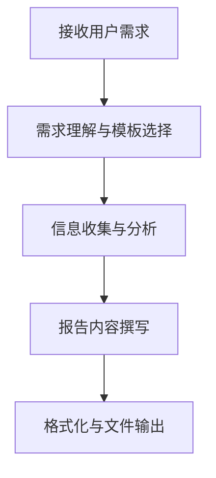

# 行业研究报告撰写规范 (Industry Research Report Writing Guide)

本文档是行业研究报告的撰写参考规范，定义了报告结构、内容标准、可信来源要求、格式规范和质量标准。适用于行业研究、市场分析、竞品对比、技术调研等场景。

## 核心原则

1. **数据驱动**：所有结论必须有可靠数据支撑，禁止主观臆断
2. **来源可追溯**：所有统计数据和关键事实必须注明来源（含完整 URL）
3. **客观中立**：以第三人称视角客观呈现，优劣并述
4. **时效性**：数据应是最新的（除历史分析外，应在 12 个月内）
5. **事实与预测分离**：已发生的事实与分析/预测之间必须有明确区分
6. **文件输出**：报告必须输出为 `.md` 文件，**禁止仅在对话中输出报告内容而不生成文件**

---

## 核心工作流



### 阶段 1：需求理解与模板选择 🎯
1. **识别研究类型**：公司研究、行业研究、还是比较分析？
2. **匹配模板**：根据研究类型从下方模板库选择（模板 A / B / C）
3. **收集素材**：确认用户提供的研究素材和数据来源

### 阶段 2：报告内容撰写 ✍️
1. 按所选模板结构组织内容
2. 遵循下方写作风格规范和可信来源标准
3. 确保所有数据有来源标注

### 阶段 3：格式化与文件输出 📦

> ⚠️ **必须将报告内容输出为 `.md` 文件**，禁止仅在对话中输出报告内容而不生成文件。

**文件命名规则：**
- 公司研究：`{公司名}_研究报告.md`
- 行业研究：`{行业名称}_行业研究报告.md`
- 比较分析：`{比较对象}_对比分析报告.md`
- 如果用户指定了输出路径，按用户指定路径存放

---

## 按研究类型划分的报告结构

根据研究对象的不同，报告的重点和结构应有所调整：

| 研究方向 | 模板 | 适用场景 | 主要参考来源 |
|------|---------|---------|-------------|
| **公司研究** | 模板 A：公司研究报告 | 以特定公司为中心的研究 | 公司年报、季报（10-K/10-Q）、投资者演示文稿、财报电话会议纪要 |
| **行业研究** | 模板 B：行业研究报告 | 涵盖广泛行业或领域的研究 | 行业研究机构报告、政府统计数据、行业白皮书、咨询公司研究 |
| **比较分析** | 模板 C：比较分析报告 | 多家公司或多产品/技术方案对比 | 公司文件和行业报告的混合、产品测评数据、用户调研 |

---

### 模板 A：公司研究报告

当研究以特定公司为中心时，使用以下结构：

```markdown
# [公司名] 研究报告

## 1. 执行摘要
- 核心发现（3-5 条关键结论）
- 关键财务指标速览
- 投资/战略建议

## 2. 公司概况
- 创立历史、发展历程、关键里程碑
- 业务范围与主营产品/服务
- 组织架构与管理团队
- 企业文化与核心价值观

## 3. 所有权与治理结构
- 主要股东及持股比例
- 机构投资者持股情况
- 董事会构成与独立性
- 重大股权变动历史

## 4. 财务表现分析
- 营收趋势（近 3-5 年）及增长率
- 利润率分析（毛利率、营业利润率、净利率）
- 现金流状况
- 资产负债结构与偿债能力
- 同比/环比变化分析

## 5. 业务与收入结构
- 按产品线/服务类型的收入明细
- 按地理区域的收入分布
- 按业务部门的利润贡献
- 各业务线的增长趋势

## 6. 竞争地位分析
- 所在行业/细分市场的市场份额
- 核心竞争优势（护城河分析）
- SWOT 分析
- 与主要竞争对手的对比

## 7. 战略与展望
- 当前战略方向与关键举措
- 研发投入与创新管线
- 并购/扩张计划
- 面临的风险与挑战
- 未来 1-3 年业绩预期

## 8. 结论与建议
- 主要发现总结
- 核心观点与评级
- 关键风险提示

## 9. 附录
- 数据来源列表（含来源可靠性评级）
- 财务数据明细表
- 分析方法说明
```

---

### 模板 B：行业研究报告

当研究涵盖广泛的行业或领域时，使用以下结构：

```markdown
# [行业名称] 行业研究报告

## 1. 执行摘要
- 行业核心发现（3-5 条关键结论）
- 市场规模与增长数据速览
- 关键趋势与战略建议

## 2. 行业概况与定义
- 行业定义与边界
- 行业发展历程
- 行业分类与细分领域

## 3. 市场规模与增长
- 全球/区域市场规模（TAM、SAM）
- 历史增长趋势（近 3-5 年）
- 未来增长预测（未来 3-5 年）
- 增长驱动因素分析

## 4. 行业结构分析
- 产业链/价值链分析（上游→中游→下游）
- 供需关系
- 行业集中度
- 进入壁垒（资本要求、技术壁垒、品牌壁垒、政策壁垒）

## 5. 竞争格局
- 主要参与者及市场份额
- 竞争者分层（头部/腰部/尾部）
- 各参与者的差异化定位
- 近期重要并购/融资事件

## 6. 关键趋势与驱动因素
- 技术趋势与创新方向
- 政策与监管变化
- 消费者/需求端变化
- 供给端结构变化

## 7. 风险与挑战
- 宏观经济风险
- 政策/监管风险
- 技术替代风险
- 供应链风险
- 行业周期性风险

## 8. 未来展望与预测
- 行业发展路径预判
- 新兴机会与蓝海市场
- 潜在颠覆性因素

## 9. 结论与建议
- 主要结论总结
- 针对不同读者（投资者/企业/政策制定者）的建议
- 关键关注指标

## 10. 附录
- 数据来源列表（含来源可靠性评级）
- 分析方法与假设说明
- 术语表
```

---

### 模板 C：比较分析报告

在比较多家公司或多个产品/技术方案时，使用以下结构：

```markdown
# [比较对象] 对比分析报告

## 1. 执行摘要
- 比较结论速览
- 各方核心优劣势
- 推荐/建议

## 2. 比较框架与方法
- 比较维度定义
- 评价标准与权重
- 数据来源与时间范围

## 3. 对象概况
- 各比较对象的基本介绍
- 各自定位与目标市场

## 4. 多维度对比分析
### 4.1 维度 A：[如产品/技术参数]
| 指标 | 对象 1 | 对象 2 | 对象 3 |
|------|--------|--------|--------|

### 4.2 维度 B：[如市场表现]
...

### 4.3 维度 C：[如财务/成本]
...

### 4.4 维度 D：[如用户评价/口碑]
...

## 5. 综合评估
- 各对象的 SWOT 总结
- 综合评分矩阵
- 竞争定位图（如波士顿矩阵、定位象限图）

## 6. 结论与建议
- 各维度最优选择
- 综合推荐（分场景）
- 选择建议与注意事项

## 7. 附录
- 完整数据对比表
- 数据来源列表
- 评价方法说明
```

---

## 写作风格规范

### 语气与用词
- **专业客观**：使用第三人称，保持中立客观立场
- **行业术语**：准确使用行业专业术语，首次出现时可附简要解释
- **简洁明了**：避免冗长句式和口语化表达
- **数据说话**：结论和论点必须有数据支撑

### 执行摘要撰写要点
- 控制在 1 页以内（约 300-500 字）
- 涵盖最重要的 3-5 条发现
- 包含关键数据指标（市场规模、增长率、市场份额等）
- 提供明确的结论或建议
- 可独立阅读，不依赖正文

### 数据呈现原则
- 大数据量对比使用表格，趋势变化使用图表
- 所有图表必须有清晰的标题、坐标轴标签和数据来源标注
- 百分比保留 1 位小数，金额根据量级选择合适单位（万/亿/百万/十亿）
- 同一报告中保持数据单位和格式的一致性

### 分析框架参考
根据分析需要，可选用以下常用框架：
- **PEST/PESTEL 分析**：宏观环境分析（政治、经济、社会、技术、环境、法律）
- **波特五力模型**：行业竞争结构分析
- **SWOT 分析**：优势、劣势、机会、威胁
- **价值链分析**：行业上下游关系
- **波士顿矩阵**：业务/产品组合分析
- **TAM/SAM/SOM**：市场规模分层分析

---

## 输出格式规范

### 输出格式
- **Markdown (.md)** 为行业研究报告的**唯一输出格式**，不支持 DOCX、PDF 等其他格式
- ⚠️ **必须将报告内容输出为 `.md` 文件**，禁止仅在对话中输出报告内容而不生成文件

### Markdown 格式要求
- 使用标准 Markdown 语法，确保在任何渲染器中均可正常显示
- 合理运用标题层级（`#` ~ `####`），不超过四级
- 数据对比使用 Markdown 表格呈现
- 关键结论使用**加粗**或 `>` 引用块突出显示
- 使用有序列表表示步骤/优先级，使用无序列表表示并列项
- 使用分隔线（`---`）分隔主要章节
- 适当使用 emoji 图标增强可读性（如 📊 📈 ⚠️ ✅ 💡）

---

## 图表规范

报告中使用的图表应遵循以下规范：

### 常用图表类型

| 数据类型 | 推荐图表 | 使用场景 |
|---------|---------|---------|
| 时间序列趋势 | 折线图 | 营收增长、市场规模变化 |
| 类别对比 | 柱状图/条形图 | 公司营收对比、各区域销量 |
| 占比/构成 | 饼图/环形图 | 市场份额、收入结构 |
| 多维对比 | 雷达图 | 竞品多维度能力对比 |
| 分布/相关性 | 散点图 | 价格-性能关系 |
| 流程/结构 | 流程图/架构图 | 产业链、价值链 |

### 图表制作要求
- 每个图表必须有清晰的**标题**
- 坐标轴必须有**标签**和**单位**
- 必须标注**数据来源**
- 颜色方案与报告主题色保持一致
- **支持 CJK 字体**：中文/日文/韩文标签必须正确渲染，不能出现乱码
- 图表编号连续（图 1、图 2、图 3...），正文中使用编号引用

---

## 质量标准

| 维度 | 优秀标准 | 不合格标准 |
|------|---------|-----------|
| **来源可靠** | 关键数据来自第一/第二层级来源，交叉验证 | 来源不明或仅依赖新闻媒体 |
| **数据时效** | 核心数据在 12 个月内，标注数据截止时间 | 使用过时数据且未说明 |
| **分析深度** | 有独立洞察，超越数据表面，使用分析框架 | 仅罗列数据，缺乏解读 |
| **逻辑严谨** | 论证链条完整，因果关系清晰 | 逻辑跳跃，结论缺乏支撑 |
| **结构清晰** | 层次分明，易于定位信息，有执行摘要 | 结构混乱，重点不突出 |
| **建议实用** | 建议具体可操作，有数据依据 | 建议空泛笼统，缺乏针对性 |
| **客观公正** | 优劣并述，风险与机遇兼顾 | 主观臆断，报喜不报忧 |
| **格式规范** | 格式统一，图表清晰，引用完整 | 格式混乱，图表模糊，缺少引用 |

---

## 语言规范

**必须遵循用户指定的语言进行输出：**

1. **检测用户语言**：识别用户提问所使用的语言
2. **遵循用户指令**：如果用户明确要求使用某种语言撰写报告，必须严格遵循
3. **默认匹配原则**：如果用户未明确指定，则使用与用户提问相同的语言撰写报告

**示例**：
- 用户用中文提问 → 报告使用中文撰写
- 用户用英文提问 → 报告使用英文撰写
- 用户说"请用英文撰写报告" → 无论用户用什么语言提问，报告必须使用英文
