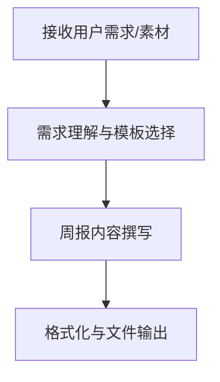

# 周报撰写规范 (Weekly Report Writing Guide)

本文档是周报的撰写参考规范，定义了各类职业角色的周报模板、写作原则、格式规范和质量标准。适用于个人周报、团队周报、部门周报、项目状态报告等场景。

## 核心原则

1. **洞察优先**：不只是罗列完成事项，要提炼趋势、异常和行动建议
2. **量化结果**：用数据说话，避免模糊描述
3. **问题闭环**：每个问题/阻碍必须附带后续行动或解决方案
4. **计划可执行**：下周计划要具体到任务、时间节点、负责人
5. **简洁高效**：确保读者在 2 分钟内可获取核心信息
6. **文件输出**：周报必须输出为 `.md` 文件，**禁止仅在对话中输出周报内容而不生成文件**

---

## 核心工作流



### 阶段 1：需求理解与模板选择 🎯
1. **识别角色**：用户是什么职业角色？（工程师、管理层、销售、运营、HR、财务等）
2. **匹配模板**：根据角色从下方模板库选择最合适的模板
3. **收集素材**：确认用户提供的周报素材（完成事项、数据指标、问题等）

### 阶段 2：周报内容撰写 ✍️
1. 按所选模板结构组织内容
2. 遵循下方写作原则，确保洞察优先、量化结果、问题闭环
3. 生成具体可执行的下周计划

### 阶段 3：格式化与文件输出 📦

> ⚠️ **必须将周报内容输出为 `.md` 文件**，禁止仅在对话中输出周报内容而不生成文件。

**文件命名规则：**
- 个人周报：`周报_{姓名}_{日期范围}.md`（如 `周报_张三_0316-0322.md`）
- 团队周报：`周报_{团队名称}_{日期范围}.md`
- 如果用户指定了输出路径，按用户指定路径存放

---

## 写作原则

### 洞察优先，而非数据堆砌
- ❌ 不好的写法：`本周完成了 5 个需求，修复了 3 个 Bug`
- ✅ 好的写法：`本周完成核心支付模块重构（5 个需求），系统稳定性提升，Bug 修复率较上周提高 40%`

### 量化结果，而非描述过程
- ❌ 不好的写法：`参与了用户调研`
- ✅ 好的写法：`完成 12 份用户深度访谈，提炼出 3 个核心痛点，已输出调研报告`

### 问题要有后续行动
- ❌ 不好的写法：`接口联调遇到问题`
- ✅ 好的写法：`接口联调发现数据格式不一致（影响登录功能），已与后端同学对齐方案，预计周三解决`

### 计划要具体可执行
- ❌ 不好的写法：`下周继续推进项目`
- ✅ 好的写法：`下周一完成首页性能优化方案评审，周三前完成代码实现，周五提测`

### 环比对比增强说服力
- 在数据指标处提供本周与上周的对比，用 ↑/↓ 和百分比变化清晰呈现趋势
- 使用状态标识（🟢/🟡/🔴）直观反映目标达成情况

---

## 模板选择指南

根据用户的职业角色和汇报场景，选择最匹配的模板：

| 模板 | 适用角色/场景 | 核心特点 |
|------|-------------|---------|
| 通用工程师周报 | 前端/后端/客户端/测试工程师 | 任务表格 + 数据指标 + 阻碍 |
| 高管/管理层周报 | 总监、VP、CEO 等管理者 | TL;DR + 关键指标仪表盘 + 需决策事项 |
| 团队周报 | 团队 Leader、小组长 | 人员概况 + 成员进展 + 任务分配 |
| 销售周报 | 销售人员、销售团队 | 业绩数据 + 管道变化 + 客户跟进 |
| 市场营销周报 | 市场、品牌、增长团队 | 渠道数据 + 内容发布 + 投放ROI |
| 项目状态报告 | 项目经理、PMO | 里程碑 + 预算 + 风险矩阵 |
| HR 周报 | 人力资源团队 | 人员动态 + 招聘进展 + 培训 |
| 运营周报 | 运营团队 | 核心运营指标 + 活动效果 + 异常分析 |
| 财务周报 | 会计、财务团队 | 资金状况 + 收支明细 + 应收应付 |

> 💡 如果用户未明确职业角色，应主动询问以匹配最合适的模板。

---

## 模板库

### 📋 通用工程师周报

适用：前端 / 后端 / 客户端 / 测试工程师

```markdown
# 周报 · [姓名] · [日期范围]

## 本周概览
> [一句话总结本周核心成果，突出最重要的 1-2 项进展]

## ✅ 本周完成
| 任务/需求 | 类型 | 工时 | 备注 |
|-----------|------|------|------|
| [任务名称] | 需求/Bug/优化 | Xh | [关键说明] |

## 🔄 进行中
| 任务/需求 | 进度 | 预计完成 | 阻碍 |
|-----------|------|----------|------|
| [任务名称] | XX% | [日期] | [如有] |

## 🚧 阻碍与风险
- **[问题描述]**：[影响范围] → 需要 [谁] 协助解决

## 📅 下周计划
1. [优先级最高的任务]
2. [次优先任务]
3. [其他计划]

## 📊 数据指标（如适用）
- 代码提交：X 次 | PR 合并：X 个 | Bug 修复：X 个
- 测试覆盖率：XX% | 性能指标：[如有]
```

---

### 👔 高管 / 管理层周报

适用：总监、VP、CEO 等管理角色

```markdown
# 周报 · [姓名/团队] · [日期范围]

## TL;DR
- 🟢 [最重要的成果，一句话]
- 🟡 [需要关注的风险，一句话]
- 🔵 [下周最关键的行动，一句话]

## 关键指标
| 指标 | 本周 | 上周 | 变化 | 目标 | 状态 |
|------|------|------|------|------|------|
| [指标名] | [值] | [值] | ↑/↓ X% | [目标值] | 🟢/🟡/🔴 |

## 🏆 本周胜场
1. **[成就标题]**：[具体说明，量化结果]
2. **[成就标题]**：[具体说明，量化结果]
3. **[成就标题]**：[具体说明，量化结果]

## ⚠️ 阻碍与风险
| 问题 | 影响 | 负责人 | 预计解决 |
|------|------|--------|----------|
| [问题描述] | 高/中/低 | [姓名] | [日期] |

## 📅 下周重点
1. [首要任务] — 负责人：[姓名]，截止：[日期]
2. [次要任务] — 负责人：[姓名]，截止：[日期]

## 🔔 需要决策 / 关注
- [需要领导层介入或知晓的事项]
```

---

### 👥 团队周报

适用：团队 Leader、小组长

```markdown
# 团队周报 · [团队名称] · [日期范围]

## 团队概况
- 本周在岗：X 人 | 请假：X 人 | 可用工时：Xh
- 整体状态：🟢 正常推进 / 🟡 轻微延迟 / 🔴 需要支持

## ✅ 本周完成
- [成员姓名]：[完成事项]
- [成员姓名]：[完成事项]

## 🔄 进行中
| 项目/任务 | 负责人 | 进度 | 预计完成 |
|-----------|--------|------|----------|
| [任务名] | [姓名] | XX% | [日期] |

## 🚧 阻塞项
- **[阻塞描述]**：等待 [依赖方] 的 [具体内容]，影响 [任务名]

## 📅 下周计划
| 任务 | 负责人 | 优先级 | 预计工时 |
|------|--------|--------|----------|
| [任务名] | [姓名] | P0/P1/P2 | Xh |

## 🌟 特别鸣谢
- **[成员姓名]**：[具体贡献，表彰原因]
```

---

### 💰 销售周报

适用：销售人员、销售团队

```markdown
# 销售周报 · [姓名/团队] · [日期范围]

## 本周业绩概览
| 指标 | 本周 | 上周 | 目标 | 完成率 |
|------|------|------|------|--------|
| 成交金额 | ¥X | ¥X | ¥X | XX% |
| 新增商机 | X 个 | X 个 | X 个 | XX% |
| 拜访客户 | X 家 | X 家 | — | — |

## 📈 管道变化
- **新增商机**：X 个，合计金额 ¥X
- **推进至高级阶段**：X 个，合计金额 ¥X
- **赢单**：X 个，合计金额 ¥X 🎉
- **丢单**：X 个，合计金额 ¥X（原因：[竞品/预算/需求变化]）

## 🔥 重点跟进客户
| 客户名称 | 阶段 | 金额 | 下一步行动 | 预计签约 |
|----------|------|------|------------|----------|
| [客户名] | [阶段] | ¥X | [行动] | [日期] |

## 📞 活动数据
- 外呼：X 通 | 有效沟通：X 次 | 拜访：X 次 | 演示：X 场

## 📊 预测 vs 实际
- 本月预测：¥X | 实际完成：¥X | 差距：¥X

## 🎯 下周行动计划
1. [具体行动] — 目标客户：[客户名]
2. [具体行动] — 目标客户：[客户名]

## 💡 关键胜负复盘
- **赢单原因**：[总结]
- **丢单原因**：[总结] → 改进措施：[措施]
```

---

### 📣 市场营销周报

适用：市场、品牌、增长团队

```markdown
# 市场营销周报 · [姓名/团队] · [日期范围]

## 本周核心数据
| 指标 | 本周 | 上周 | 变化 | 目标 |
|------|------|------|------|------|
| 曝光量 | X | X | ↑/↓X% | X |
| 点击量 | X | X | ↑/↓X% | X |
| 转化率 | X% | X% | ↑/↓Xpp | X% |
| 获客成本 | ¥X | ¥X | ↑/↓X% | ¥X |
| 新增线索 | X | X | ↑/↓X% | X |

## 📝 内容发布
| 内容标题 | 渠道 | 发布时间 | 曝光 | 互动率 |
|----------|------|----------|------|--------|
| [标题] | [渠道] | [日期] | X | X% |

## 🎯 广告投放
- **总消耗**：¥X（预算：¥X，执行率：XX%）
- **ROI**：X | **CPL**：¥X | **CPA**：¥X
- 表现最佳广告组：[名称]，转化率 XX%
- 表现最差广告组：[名称]，已暂停/调整

## 📱 社交媒体
| 平台 | 新增粉丝 | 发帖数 | 总互动 | 最佳内容 |
|------|----------|--------|--------|----------|
| [平台] | +X | X | X | [内容标题] |

## 🧪 A/B 测试
- **测试项目**：[描述]
- **结论**：方案 A/B 胜出，提升 XX%
- **下一步**：[行动]

## 📅 下周计划
1. [活动/内容计划]
2. [投放调整计划]
```

---

### 🏗️ 项目状态报告

适用：项目经理、PMO

```markdown
# 项目状态报告 · [项目名称] · [日期范围]

## 整体状态：🟢 正常 / 🟡 注意 / 🔴 风险

> **状态说明**：[一句话说明当前状态原因]

## 里程碑进展
| 里程碑 | 计划日期 | 实际/预计 | 状态 | 说明 |
|--------|----------|-----------|------|------|
| [里程碑名] | [日期] | [日期] | 🟢/🟡/🔴 | [说明] |

## 💰 预算状况
- 总预算：¥X | 已使用：¥X（XX%）| 剩余：¥X
- 预算偏差：[超支/节余] ¥X，原因：[说明]

## 📅 进度遵守情况
- 计划完成任务：X 项 | 实际完成：X 项 | 完成率：XX%
- 延期任务：X 项（[任务名]，延期 X 天，原因：[说明]）

## 🔑 本周关键决策
| 决策内容 | 决策人 | 日期 | 影响 |
|----------|--------|------|------|
| [决策描述] | [姓名] | [日期] | [影响说明] |

## ✅ 待办事项
| 事项 | 负责人 | 截止日期 | 优先级 |
|------|--------|----------|--------|
| [事项描述] | [姓名] | [日期] | P0/P1/P2 |

## ⚠️ 风险与问题
| 风险/问题 | 影响程度 | 应对措施 | 负责人 |
|-----------|----------|----------|--------|
| [描述] | 高/中/低 | [措施] | [姓名] |
```

---

### 🧑‍💼 HR 周报

适用：人力资源团队

```markdown
# HR 周报 · [日期范围]

## 人员动态
- 在职总人数：X 人 | 本周入职：X 人 | 本周离职：X 人
- 净增人数：+X / -X

## 招聘进展
| 岗位 | 需求数 | 在招 | 面试中 | 已 Offer | 已入职 |
|------|--------|------|--------|----------|--------|
| [岗位名] | X | X | X | X | X |

## 员工关系
- 本周处理事项：[简述]
- 员工满意度/反馈：[如有]

## 培训与发展
- 本周培训：[培训名称]，参与人数：X 人
- 培训完成率：XX%

## 薪酬与考勤
- 异常考勤：X 人次（已处理：X 人次）
- 本周审批事项：[简述]

## 📅 下周重点工作
1. [工作项]
2. [工作项]
```

---

### 📊 运营周报

适用：运营团队

```markdown
# 运营周报 · [日期范围]

## 核心数据概览
| 指标 | 本周 | 上周 | 变化 | 目标 | 状态 |
|------|------|------|------|------|------|
| DAU/MAU | X | X | ↑/↓X% | X | 🟢/🟡/🔴 |
| 新增用户 | X | X | ↑/↓X% | X | 🟢/🟡/🔴 |
| 留存率（次日） | X% | X% | ↑/↓Xpp | X% | 🟢/🟡/🔴 |
| 核心转化率 | X% | X% | ↑/↓Xpp | X% | 🟢/🟡/🔴 |

## 🎯 本周活动/运营动作
| 活动名称 | 时间 | 目标 | 实际效果 | 结论 |
|----------|------|------|----------|------|
| [活动名] | [时间] | [目标] | [效果] | 达成/未达成 |

## 📈 异常分析
- **[指标名] 异常**：本周 [上升/下降] XX%，原因分析：[分析]，应对措施：[措施]

## 📅 下周运营计划
| 计划事项 | 目标 | 负责人 | 时间节点 |
|----------|------|--------|----------|
| [事项] | [目标] | [姓名] | [日期] |

## 💡 洞察与建议
- [基于数据的洞察和行动建议]
```

---

### 💻 财务周报

适用：会计、财务团队

```markdown
# 财务周报 · [日期范围]

## 资金状况
- 期初余额：¥X | 本周收入：¥X | 本周支出：¥X | 期末余额：¥X

## 收入情况
| 收入类型 | 本周 | 上周 | 变化 | 本月累计 |
|----------|------|------|------|----------|
| [类型] | ¥X | ¥X | ↑/↓X% | ¥X |

## 支出情况
| 支出类型 | 本周 | 预算 | 执行率 | 说明 |
|----------|------|------|--------|------|
| [类型] | ¥X | ¥X | XX% | [说明] |

## 应收 / 应付
- 应收账款：¥X（逾期：¥X，涉及 X 家客户）
- 应付账款：¥X（本周到期：¥X）

## 本周完成事项
- [已完成的财务工作，如：月度对账、报销审核等]

## ⚠️ 风险提示
- [资金风险、合规风险等]

## 📅 下周重点
1. [工作项]
2. [工作项]
```

---

## 输出格式规范

### 输出格式
- **Markdown (.md)** 为周报的**唯一输出格式**，不支持 DOCX、PDF 等其他格式
- ⚠️ **必须将周报内容输出为 `.md` 文件**，禁止仅在对话中输出周报内容而不生成文件

### Markdown 格式要求
- 使用标准 Markdown 语法，确保在任何渲染器中均可正常显示
- 合理运用标题层级（`#` ~ `####`），不超过四级
- 数据对比使用 Markdown 表格呈现
- 关键结论使用**加粗**或 `>` 引用块突出显示
- 使用有序列表表示步骤/优先级，使用无序列表表示并列项
- 适当使用 emoji 图标增强可读性（如 ✅ 🔄 🚧 📅 📊）

### 状态标识规范

| 标识 | 含义 | 使用场景 |
|------|------|---------|
| 🟢 | 正常/达标/已完成 | 指标达成、任务完成、状态健康 |
| 🟡 | 注意/接近风险 | 指标未达标但可控、轻微延期 |
| 🔴 | 风险/严重问题 | 指标严重偏离、重大延期、需要升级 |
| ↑/↓ | 环比上升/下降 | 数据对比中的变化方向 |
| P0/P1/P2 | 优先级高/中/低 | 任务和计划的优先级标识 |

---

## 质量标准

| 维度 | 优秀标准 | 不合格标准 |
|------|---------|-----------|
| **信息完整** | 涵盖完成事项、进行中、阻碍、下周计划等核心板块 | 缺少关键板块，信息不完整 |
| **量化呈现** | 关键成果有数据支撑，指标有环比对比 | 全是文字描述，缺乏数据 |
| **问题闭环** | 每个阻碍/问题附有影响分析和后续行动 | 只列问题不给方案 |
| **计划具体** | 下周计划有明确任务、时间节点、负责人 | 计划笼统模糊，无法执行 |
| **结构清晰** | 层次分明，重点突出，2 分钟可读完核心 | 结构混乱，冗长无重点 |
| **洞察深度** | 有趋势分析、异常归因、改进建议 | 仅罗列事实，无分析思考 |
| **风格适配** | 匹配汇报对象（向上汇报正式、团队内部高效） | 风格与场景不匹配 |

---

## 语言规范

**必须遵循用户指定的语言进行输出：**

1. **检测用户语言**：识别用户提问所使用的语言
2. **遵循用户指令**：如果用户明确要求使用某种语言撰写周报，必须严格遵循
3. **默认匹配原则**：如果用户未明确指定，则使用与用户提问相同的语言撰写周报
