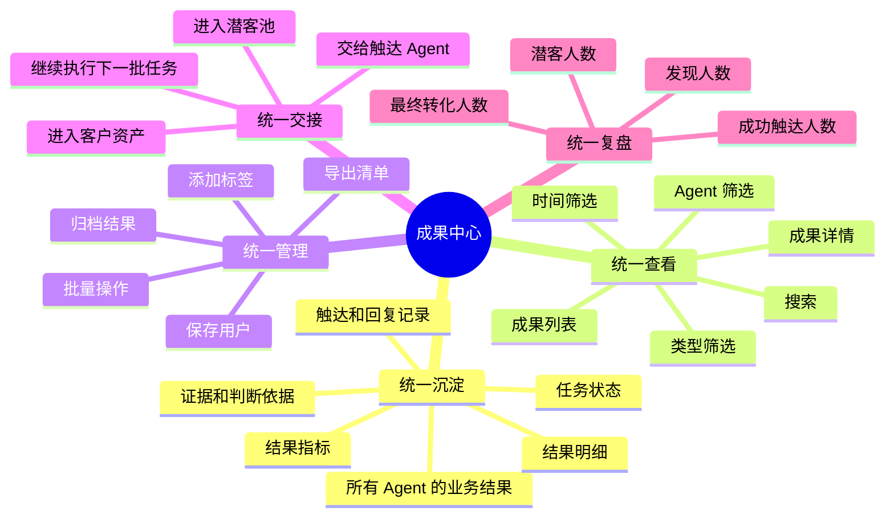
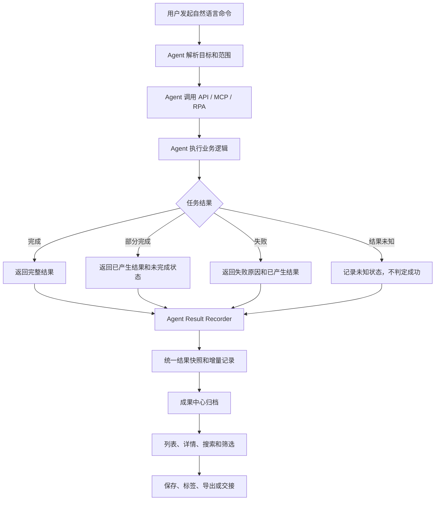
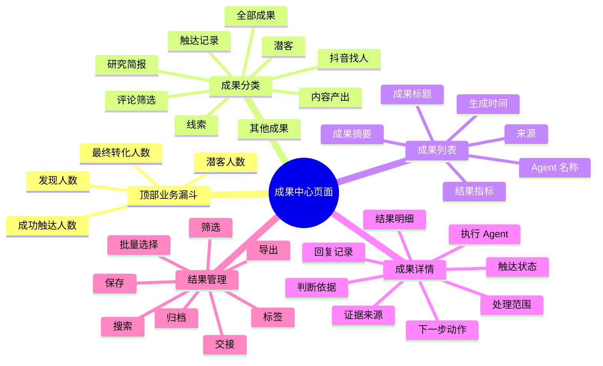
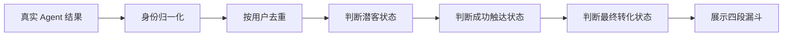

# 成果中心逻辑说明

## 1. 文档目的

成果中心是 Byering 中所有 Agent 业务产出的统一工作台。

它解决的不是“如何完成某一项业务任务”，而是解决任务完成后：

- 结果保存在哪里；
- 用户如何找到结果；
- 用户如何查看证据和判断依据；
- 用户如何管理、筛选、导出结果；
- 结果如何交给下一个 Agent 继续推进；
- 业务如何从发现一路统计到转化。

最重要的产品边界是：

> **Agent 负责理解任务、执行任务并产生业务事实；成果中心负责接收事实、统一沉淀、展示、管理、交接和复盘。**

成果中心不是一个新的业务 Agent，也不重新执行其他 Agent 的分析逻辑。

---

## 2. 成果中心的核心定位



成果中心的本质不是“结果展示页”，而是一个连接 Agent 和业务资产的中间层：

```text
用户命令
    ↓
Agent 理解并执行任务
    ↓
Agent 返回真实结果、证据、状态和指标
    ↓
成果记录器统一接收
    ↓
成果中心归档、归类、去重、展示
    ↓
用户查看、管理、导出或交给下一个 Agent
    ↓
潜客推进、触达、回复、转化
```

---

## 核心映射：每个 Agent 产出什么，成果中心怎么呈现

这是理解成果中心最重要的一张表：

| Agent | Agent 负责的工作 | 核心产出 | 成果中心结果类型 | 页面呈现 | 下一步动作 |
| --- | --- | --- | --- | --- | --- |
| 评论区潜客挖掘专家 | 从指定作品评论中发现有需求或购买信号的用户 | 抖音账号、原始评论、来源作品、评论时间、意向等级、判断理由 | 潜客 | 潜客账号列表、评论证据、意向判断 | 保存、打标签、归档、进入触达 |
| 作品评论筛选专员 | 按条件分析作品评论，筛选负面评价、投诉、竞品提及等信号 | 匹配评论、用户、原话、来源作品、时间、判断理由 | 评论筛选 | 评论列表、原话证据、来源作品、可触达身份 | 选择用户，交给私信触达 |
| 评论区获客管家 | 监听启动后的新增评论，分析意图并持续形成潜客 | 新增评论、潜客、意向判断、触达记录、回复回流 | 潜客 / 触达记录 | 长期任务、实时新增潜客、触达状态、回复记录 | 继续监听、触达、跟进 |
| 抖音找人专家 | 根据自然语言目标批量验证用户提供的账号线索 | 候选账号、账号画像、近期作品、直播状态、评分、证据 | 抖音找人 | 专用账号表格、画像数据、评分、匹配理由 | 筛选、保存、导出、交给外联 |
| 直播间获客专家 | 从直播间互动中识别潜客和意向信号 | 观众账号、互动原话、直播场次、商品、意向分层 | 潜客 / 触达记录 | 直播潜客清单、互动证据、意向等级 | 触达、跟进 |
| 私信承接 / 自动回复专员 | 监听已授权账号私信，理解会话并生成或发送回复 | 会话、用户问题、回复草稿、审批状态、发送状态 | 触达记录 | 会话记录、回复草稿、发送状态、人工处理项 | 审批、发送、转人工 |
| 私信触达专员 | 接收并执行抖音私信触达 | 目标用户、消息内容、发送结果、失败原因、未知状态 | 触达记录 | 触达批次、成功/失败/未知统计、单用户状态 | 重试、查看回执、跟进 |
| 指定账号调研专员 | 研究指定账号或账号集合 | 账号画像、基础数据、内容概况、经营数据、来源证据 | 研究简报 | 调研简报、指标摘要、来源证据 | 继续分析、交给销售 |
| 条件人群搜索专员 | 根据地域、简介和账号类型组合条件搜索人群 | 目标人群清单、命中条件、置信度、待核验字段 | 潜客 / 其他成果 | 条件命中清单、待核验字段 | 核验、保存、交给意向分析 |
| 粉丝关系分析专员 | 分析粉丝、关注和共同受众关系 | 相似账号、竞品账号、关系类型、重叠规模、置信度 | 研究简报 | 关系清单或图谱、关系证据 | 扩展找人范围、研究竞品 |
| 账号趋势分析师 | 分析粉丝、播放、互动等时间序列 | 趋势报告、变化幅度、异常说明、对比指标 | 研究简报 | 趋势摘要、指标图表、异常说明 | 调整内容和获客策略 |
| 潜客意向分析师 | 汇总候选结果并按证据进行意向分层 | 高/中/低意向、评分、标签、判断依据、推荐动作 | 潜客 | 潜客分层表、评分理由、证据链接 | 排优先级、交给触达 |
| 潜客跟进专员 | 根据触达结果安排回访、复购和预约 | 跟进计划、负责人、时间点、触发和停止条件 | 触达记录 / 潜客 | 跟进计划、待办节点、客户阶段 | 执行回访、更新状态 |
| 高意向电话邀约专员 | 准备外呼脚本并整理通话记录 | 通话纪要、客户原话、异议、预约清单、下一步 | 触达记录 | 通话记录、预约清单、意向变化 | 预约、继续跟进 |
| 内容生成专员 | 将业务素材整理成作品、直播和私信内容 | 标题、正文、素材说明、渠道规格、发布计划 | 内容产出 | 内容稿件、渠道规格、发布建议 | 审核、发布 |

### 这张表的关键原则

结果类型描述的是“一次任务交付了什么”，不是简单复制 Agent 名称。

- 评论区获客管家可能先产生“潜客”，后续再产生“触达记录”和“回复回流”；
- 直播间获客专家先产生“互动证据”，再形成“潜客”；
- 抖音找人专家只负责找账号和验证账号，不负责评论筛选、私信和购买意向判断；
- 私信触达专员负责消息和发送结果，不负责重新判断用户是否为潜客；
- 内容生成专员的内容稿件不会自动计入发现、潜客、触达或转化人数。

成果中心必须同时保留两个身份：

```text
谁产生了结果？        Agent 身份
这次产生了什么？      结果类型
```

用户看到的是“某个 Agent 产生的某种业务结果”，而不是一个没有来源的通用结果卡片。

### 当前已经能形成真实成果的 Agent

当前已经具备端到端执行路径、可以形成真实成果记录的 Agent 有 6 个：

| Agent | 当前成果记录方式 | 当前页面呈现 |
| --- | --- | --- |
| 评论区潜客挖掘专家 | 读取作品评论并识别潜客后写入潜客记录和运行结果 | 潜客账号列表、评论详情、意向证据、保存和触达 |
| 作品评论筛选专员 | 任务返回评论结果后写入成果运行记录和潜客记录 | 评论筛选结果、评论证据、私信交接 |
| 评论区获客管家 | 创建长期任务并持续接收状态和事件 | 实时工作、长期任务状态和后续结果回写 |
| 抖音找人专家 | 完成批次后写入专用找人结果记录 | 抖音找人分类、账号表格、评分、证据、导出 |
| 私信承接 / 自动回复专员 | 启动、轮询、发送或停止时写入结果记录 | 私信会话、回复草稿、发送状态、异常 |
| 私信触达专员 | 每次触达批次写入发送结果和单用户状态 | 触达记录、成功/失败/未知统计、回执 |

### 已定义产出但尚未接入真实执行的 Agent

以下 Agent 在 Agent 广场中已经定义了职责、输入和交付标准，但当前还没有稳定的真实执行器，不能把规划中的产出当作成果中心里的真实结果：

- 直播间获客专家；
- 指定账号调研专员；
- 条件人群搜索专员；
- 粉丝关系分析专员；
- 账号趋势分析师；
- 潜客意向分析师；
- 潜客跟进专员；
- 高意向电话邀约专员；
- 内容生成专员。

只有真实执行器接入并返回结构化结果后，它们才应进入成果中心。

## 3. Agent 与成果中心的职责边界

### 3.1 Agent 负责什么

每个 Agent 都有自己的业务定位和执行逻辑。Agent 负责：

1. 理解用户自然语言命令；
2. 确定任务范围和执行条件；
3. 调用对应的 API、MCP、RPA 或云电脑能力；
4. 执行搜索、分析、筛选、生成或触达；
5. 形成真实的业务结果；
6. 返回结果明细、证据、判断依据和执行状态；
7. 在任务继续运行时持续更新结果。

Agent 决定“业务上应该做什么”和“结果如何产生”。

### 3.2 成果中心负责什么

成果中心负责：

1. 接收 Agent 的结构化结果；
2. 为结果绑定任务、Agent、来源和时间；
3. 统一结果类型和展示格式；
4. 保存完整结果，而不是只保存一个摘要；
5. 展示原始事实、证据、判断理由和失败信息；
6. 提供搜索、筛选、批量选择、标签、保存、归档和导出；
7. 将结果交给下一个 Agent；
8. 汇总业务漏斗和历史结果。

成果中心决定“结果如何被看见、管理和继续使用”。

### 3.3 成果中心明确不负责什么

成果中心不应：

- 替代抖音找人专家进行账号搜索；
- 替代作品评论筛选专员进行评论判断；
- 替代评论区获客管家监听新增评论；
- 替代触达 Agent 发送私信；
- 修改其他 Agent 的业务规则；
- 在没有真实结果时生成模拟数据；
- 把失败或结果未知的任务统计为成功；
- 把“任务有记录”误认为“业务已完成”。

---

## 4. Agent 产出与成果中心的对应关系

### 4.1 抖音找人专家

用户先用自然语言描述想找的人，再提供需要验证的主页、分享文本或 `sec_uid`。当前生产接口未发布自然语言账号搜索能力，不能仅凭目标描述发现陌生账号。

Agent 负责：

- 理解目标人群；
- 根据行业、关键词、地域、粉丝范围、内容特征等条件验证账号线索；
- 解析账号身份；
- 获取账号画像；
- 获取近期作品和作品表现；
- 获取直播状态；
- 计算匹配评分；
- 输出匹配理由；
- 返回候选账号批次。

成果中心保存：

- 任务目标和检索条件；
- 候选账号列表；
- 昵称、账号、主页链接；
- sec_id、sec_uid 等身份信息；
- 粉丝数、作品数、获赞数；
- 地域和直播状态；
- 匹配评分和匹配理由；
- 账号状态和标签；
- 本批账号的统计信息。

用户后续可以：

- 搜索和筛选账号；
- 批量保存账号；
- 批量添加标签；
- 导出 CSV；
- 将候选账号交给外联 Agent；
- 继续找下一批账号。

### 4.2 作品评论筛选专员

Agent 负责从指定作品或作品集合的评论中筛选符合条件的评论。

成果中心保存：

- 评论用户；
- 用户原话；
- 来源作品；
- 评论时间；
- 匹配状态；
- 意向或负面判断；
- 判断理由；
- 置信度和信号词；
- 用户主页或 sec_uid 等触达身份。

用户后续可以：

- 查看评论证据；
- 选择可触达用户；
- 将选中的用户交给私信触达 Agent；
- 导出评论筛选结果；
- 对结果进行保存、标签和归档。

### 4.3 评论区获客管家

评论区获客管家的核心工作是监听 Agent 启动后产生的新评论。

其逻辑不是分析固定历史作品，而是：

```text
启动监听
    ↓
接收后续新增评论
    ↓
分析评论意图
    ↓
识别潜客
    ↓
生成潜客和判断依据
    ↓
交给触达流程
```

成果中心保存：

- 新增评论事件；
- 评论用户和原话；
- 评论来源；
- 意图分析结果；
- 潜客等级和评分；
- 判断理由；
- 触达准备状态；
- 后续回复和触达结果。

### 4.4 私信承接和自动回复 Agent

Agent 负责接收新增私信、读取上下文、生成回复草稿，并根据配置决定是否进入自动回复或人工审批。

成果中心保存：

- 新增会话；
- 用户消息；
- 上下文信息；
- 回复草稿；
- 审批状态；
- 发送状态；
- 用户回复；
- 异常和重试信息。

### 4.5 私信触达专员 Agent

Agent 负责把已经确认可以触达的用户转化为触达任务，并在审批或授权条件满足后执行发送。

成果中心保存：

- 触达对象；
- 触达来源；
- 消息内容；
- 发送状态；
- 送达状态；
- 失败原因；
- 结果未知状态；
- 用户回复；
- 后续跟进建议。

### 4.6 评论区潜客挖掘专家到线索中心的闭环

“评论区潜客挖掘专家”是评论区潜客发现能力，和“抖音找人专家”不是同一类结果：

```text
评论区潜客挖掘专家 / 作品评论筛选专员
    ↓
潜客结果写入成果中心「潜客」
    ↓
状态：待触达
    ↓ 一键触达
私信触达专员（目标账号由成果中心预填）
    ↓
触达成功回写成果中心
    ↓
状态：已触达
    ↓ 开启私信承接
私信承接 / 自动回复专员监听新私信
    ↓
有问题：通过 RPA 连续对话，引导留资
有联系方式：停止自动回复，记录联系方式
    ↓
状态：已留资，进入「线索中心」
```

成果中心在这条链路中承担业务状态管理：

| 阶段 | 成果中心位置 | 状态 | 可执行动作 |
| --- | --- | --- | --- |
| 评论区发现 | 潜客 | 待触达 | 筛选、保存、标签、一键触达 |
| 私信发送成功 | 潜客 | 已触达 | 查看回执、开启私信承接 |
| 已开始监听 | 潜客 | 跟进中 | 查看实时工作、停止承接 |
| 用户留下联系方式 | 线索中心 | 已留资 | 查看留资信息、人工跟进、确认转化 |
| 确认成交或进入客户资产 | 线索中心 | 已转化 | 查看转化记录、推进交付或复购 |

两类直接使用场景也遵循同一原则：

- 直接使用私信触达专员：触达成功后写入“已触达”；如果不是来自潜客结果，增加“直接触达”标签，不虚构高意向判断。
- 直接使用私信承接 / 自动回复专员：监听到真实联系方式后直接创建“已留资”线索，写入线索中心。

抖音找人专家是例外。它的任务可能是找竞品账号、找达人或找其他目标人群，不默认进入潜客漏斗。它按“一次任务一个文件”写入成果中心的“抖音找人”分类，用户可以在该文件内筛选、保存、导出或手动交给外联流程。

---

## 5. 成果的标准数据流

### 5.1 一次任务的完整链路



### 5.2 每条成果必须能回答的问题

一条成果记录至少要能够回答：

| 问题 | 对应字段或信息 |
| --- | --- |
| 谁产生的？ | `agentId`、`agentName` |
| 哪次任务产生的？ | `taskId`、`taskRunId` |
| 什么时候产生的？ | `generatedAt`、更新时间 |
| 从哪里来的？ | `source`、来源作品、来源账号 |
| 任务做到哪一步？ | `status`、运行状态 |
| 得到了什么？ | `items`、`leads`、`artifacts` |
| 为什么这样判断？ | `evidence`、`decisions`、`reason` |
| 有多少结果？ | `counts`、`metrics` |
| 还能做什么？ | `actions`、交接信息 |
| 是否触达成功？ | `sent`、`delivered`、回执记录 |
| 是否产生回复？ | `replies` |

成果中心不应该只保留一句“任务完成”，而应该保留可以继续使用和复盘的业务数据。

---

## 6. 成果中心页面结构

### 6.1 页面分层



### 6.2 列表和详情的关系

成果列表负责快速扫描，成果详情负责完整核验。

列表中展示：

- 成果标题；
- Agent 名称；
- 成果类型；
- 来源；
- 时间；
- 关键数量指标。

详情中展示：

- 完整结果；
- 真实数据明细；
- 证据和判断理由；
- 失败、部分完成或未知状态；
- 可执行的下一步动作。

用户不应该只能看到摘要，而无法查看原始产出和证据。

---

## 7. 结果管理逻辑

### 7.1 查看

用户进入成果中心后，默认看到成果列表和详情区域。

用户可以：

1. 点击成果卡片选中结果；
2. 双击成果卡片快速查看详情；
3. 在详情区域查看完整产出；
4. 从详情中打开对应 Agent 对话；
5. 从详情中继续执行后续动作。

### 7.2 搜索和筛选

支持按照以下信息筛选：

- 成果类型；
- Agent；
- 账号；
- 关键词；
- 来源；
- 任务时间；
- 结果状态。

筛选只改变展示范围，不改变原始结果。

### 7.3 批量管理

对于账号或评论用户结果，用户可以批量：

- 保存到潜客或联系人；
- 添加标签；
- 归档；
- 导出；
- 交给触达 Agent。

批量操作必须保留来源任务和来源证据，不能让用户失去结果上下文。

### 7.4 交接

成果中心可以发起交接，但不代替下一个 Agent 执行任务。

例如：

```text
作品评论筛选结果
    ↓ 用户选择高意向评论用户
成果中心生成预填充交接数据
    ↓
私信触达 Agent 接收用户、主页、sec_uid 和来源证据
    ↓
触达 Agent 负责生成内容、审批和发送
    ↓
触达结果回写成果中心
```

交接时至少需要保留：

- 来源成果 ID；
- 来源任务 ID；
- 用户身份；
- 用户主页；
- 原始评论或匹配理由；
- 交接时间；
- 后续 Agent 的任务 ID。

---

## 8. 业务漏斗口径

成果中心顶部使用四段漏斗：

```text
发现人数 → 潜客人数 → 成功触达人数 → 最终转化人数
```

### 8.1 发现人数

统计已经完成公开内容分析或账号候选检索的用户总数，并按账号身份去重。

这里的“发现”是分析全集，不等于潜客人数：

- 包含被分析后判定为潜客的用户；
- 也包含被分析后判定为非潜客、暂不推进的用户；
- 评论区分析优先读取任务结果中的完整分析名单，而不是只读取最终写入潜客池的名单；
- 抖音找人专家的候选账号可以计入发现，但仍保留在“抖音找人”的独立任务文件中，不写入普通潜客池。

例如一批任务分析了 100 人，其中 35 人被判定为潜客，漏斗应显示“发现 100、潜客 35”。

身份优先级：

1. `sec_uid`、`secUid`、`externalUserId` 或 `uniqueId`；
2. `accountId`、`uid` 或其他账号级身份字段；
3. 用户主页链接；
4. 用户名或昵称；
5. `commentId` 或任务内序号只作为无法获得用户身份时的兜底，不作为跨评论的用户身份。

### 8.2 潜客人数

统计已经被识别为可继续推进、但尚未进入线索中心的用户。

当前判断依据是：

```text
status !== "已留资" && conversionStatus !== "已转化"
```

因此，已触达但尚未留资、正在私信承接、暂未回复的用户仍属于潜客；只有实际留资或确认转化后，才进入线索中心。

### 8.3 成功触达人数

只统计已经返回成功结果的用户，包括：

- `sent`；
- `delivered`；
- `success`；
- `succeeded`；
- `accepted`；
- 明确的“已发送”“已送达”“成功”“已触达”。

不统计：

- `failed`；
- `error`；
- `unknown`；
- 仅生成草稿；
- 仅进入审批队列；
- 仅创建触达任务。

同一用户重复触达时，漏斗按用户去重，不按发送次数累加。

### 8.4 最终转化人数

统计明确标记为：

```text
conversionStatus === "已转化"
```

并已经进入客户资产的用户。

### 8.5 漏斗统计原则



漏斗是业务结果的汇总，不是任务数量的汇总。

例如：

- 10 个触达任务不等于 10 个成功触达用户；
- 1 个任务失败但产生 3 个真实结果，成果中心应保留这 3 个结果；
- 发送结果未知时，不能计入成功触达；
- 同一个人被多个 Agent 发现，只能按一个人计数。

---

## 9. 状态和异常处理

### 9.1 任务状态

成果中心需要区分：

- 执行中；
- 已完成；
- 部分完成；
- 已停止；
- 执行失败；
- 结果未知。

### 9.2 部分完成

部分完成不是失败。

如果 Agent 已经产生真实结果，即使后续步骤没有完成，也应：

1. 保存已经产生的结果；
2. 显示已完成数量；
3. 显示未完成或失败原因；
4. 保留继续执行或重试入口。

### 9.3 失败

失败任务可以进入成果中心，但必须明确标记为失败。

失败记录应包含：

- 失败阶段；
- 错误信息；
- 是否可重试；
- 已产生的真实结果；
- 建议的下一步动作。

### 9.4 结果未知

结果未知表示系统无法确认平台动作是否成功。

结果未知不能被展示为：

- 已发送；
- 已送达；
- 成功触达；
- 已完成。

用户应看到“结果未知，需要核验”的明确状态。

---

## 10. 典型业务示例

### 10.1 抖音找人专家

```text
用户：验证这批抖音账号，找出上海做家居改造、粉丝 1 万到 20 万的账号。
    ↓
用户提供主页、分享文本或 sec_uid
    ↓
抖音找人专家解析并验证账号
    ↓
返回 50 个候选账号，其中 32 个匹配条件
    ↓
成果中心保存完整账号、画像、作品、评分和理由
    ↓
用户在成果中心查看本批结果
    ↓
用户筛选高匹配账号并导出或交给外联 Agent
```

成果中心展示：

- 本批任务；
- 50 个候选账号；
- 32 个匹配账号；
- 每个账号的画像和证据；
- 可批量管理的账号清单。

### 10.2 作品评论筛选专员

```text
用户：筛选这些作品里明确询价或求链接的评论。
    ↓
作品评论筛选专员读取评论并分析
    ↓
筛出匹配评论
    ↓
成果中心保存评论原话、用户、来源作品和判断理由
    ↓
用户选择高意向用户
    ↓
交给私信触达 Agent
```

成果中心不负责判断“什么叫明确询价”，这个判断属于评论筛选专员。

### 10.3 评论区获客管家

```text
用户启动评论区获客管家
    ↓
Agent 监听启动后的新增评论
    ↓
识别出有明确购买意图的用户
    ↓
成果中心实时写入潜客和评论证据
    ↓
用户查看新增潜客
    ↓
触达 Agent 继续处理
```

成果中心负责保存和展示持续产生的结果，不负责监听评论本身。

---

## 11. 当前实现对应关系

| 模块 | 负责内容 |
| --- | --- |
| `src/salebuddy/agents/agent-result-recorder.js` | 记录 Agent 的结构化业务结果 |
| `src/salebuddy/ui/prospect-store.js` | 保存、更新和持久化成果运行记录与潜客记录 |
| `src/salebuddy/ui/prospect-center.js` | 成果中心页面、列表、详情、筛选、漏斗和管理操作 |
| `src/salebuddy/ui/douyin-finder-results.js` | 抖音找人账号的身份归一化、展示和导出 |
| `src/salebuddy/ui/agent-square.js` | 各 Agent 任务执行，以及将结果写入成果记录器 |

当前成果中心的结果类型包括：

- 全部成果；
- 潜客；
- 线索；
- 抖音找人；
- 触达记录；
- 评论筛选；
- 研究简报；
- 内容产出；
- 其他成果。

---

## 12. 一句话总结

成果中心要做的是：

> **把每个 Agent 已经完成的真实工作，变成可查看、可验证、可管理、可交接、可复盘的业务资产。**

Agent 决定结果如何产生，成果中心决定结果如何继续产生价值。
